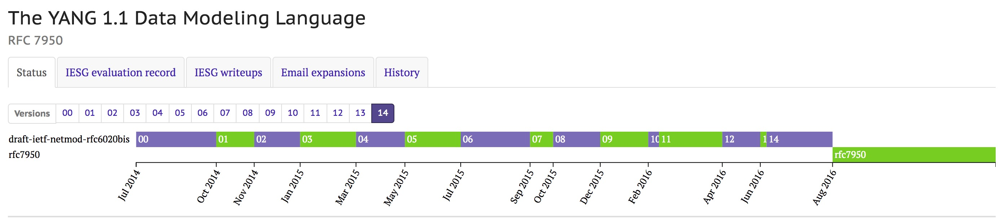

# YANG 1.1 数据建模语言

> [RFC7950 (The YANG 1.1 Data Modeling Language)](https://tools.ietf.org/html/rfc7950) 中文翻译版本

## 摘要

`YANG`是一种数据建模语言(`data modeling language`)，用于对网络管理协议中配置数据(`model configuration data`)，状态数据(`state data`)，远程过程调用(`Remote Procedure Calls`)和通知(`notifications`)进行建模。

本文档描述了`YANG`语言版本1.1的语法和语义。 `YANG`版本1.1是`YANG`语言的维护版本，修复了原规范中的歧义和缺陷。 与`YANG`版本1中有少量不兼容。本文档还指定了`YANG`到`NETCONF`的映射。

## 本备忘录的状态

这是一个互联网标准跟踪文件。

本文档是Internet工程任务组（IETF）的产品。 它代表了IETF社区的共识。 已经接受公众评议，并获得互联网工程指导组（IESG）的批准。 有关Internet标准的更多信息，请参阅[RFC 7841的第2部分](https://tools.ietf.org/html/rfc7841#section-2)。

有关本文档当前状态的信息，所有勘误表，以及如何提供反馈意见，请访问 http://www.rfc-editor.org/info/rfc7950。

## 版权声明

版权所有（c）2016 IETF Trust和被确定为文档作者的人员。版权所有。

本文档受[BCP 78](https://tools.ietf.org/html/bcp78)和IETF信托关于IETF文档的法律条款 http://trustee.ietf.org/license-info 的约束，在本文档发布之日起即生效。请仔细阅读这些文档，因为它们描述了您对本文档的权利和限制。从本文档中提取的代码必须包含该法律条款文档第4.e节中所述的简化BSD许可证文本，并且如简化BSD许可证所述不提供任何保证。

本文档可能包含2008年11月10日之前发布或公开发布的IETF文档或IETF文稿的材料。IETF组织之外的权利所有人可能未授予IETF信托对此类材料进行IETF标准过程之外修改的权利。如果没有获得控制此类材料版权的人员的适当许可，本文档不得在IETF标准过程之外进行修改，并且其衍生作品不得在IETF标准过程之外创建，除非格式化为RFC出版或将其翻译成英语以外的语言。
